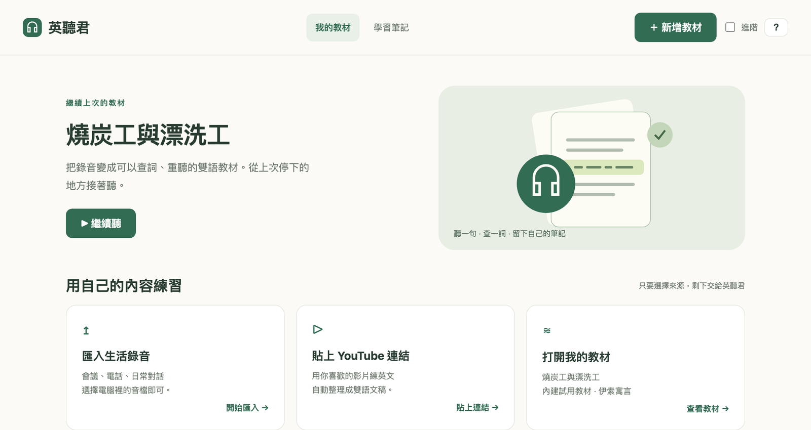

# Yingtingjun

**Turn real-life English you could not catch into private bilingual listening lessons.**

Yingtingjun is a local-first listening tool for macOS, Windows, and Linux. Bring your own real recordings, and it turns them into replayable bilingual study material with speaker labels, timestamps, notes, dictionary lookup, and partial re-transcription.

[繁體中文說明](README.zh-TW.md) · [Contributing](CONTRIBUTING.md) / [如何參與](CONTRIBUTING.zh-TW.md) · [Installation](docs/installation.md) / [安裝說明](docs/installation.zh-TW.md) · [Development](docs/development.md) / [開發說明](docs/development.zh-TW.md) · [Troubleshooting](docs/troubleshooting.md) / [疑難排解](docs/troubleshooting.zh-TW.md)

## How It Works

1. Import any real English conversation recording, or paste a YouTube URL via **Import → YouTube** in the player.
2. Detect English, transcribe, and translate locally (YouTube videos with English captions can use a faster caption path).
3. Review in the browser player while replaying, shadowing, taking notes, and fixing bad segments.

## Why It Feels Different

Most listening tools are built around generic content. Yingtingjun is for the English you actually run into in daily life: work calls, casual conversations, interviews, meetings, and voice notes.

- Your files stay on your computer. Packaged installs keep transcripts and notes in `Documents/Yingtingjun/data/`.
- The output is designed for repeated listening, not just transcription.
- The browser player supports notes, dictionary lookup, and partial re-transcription.

## Product View

Browser player with bilingual transcript, speaker turns, notes, and click-to-lookup dictionary.

## Platforms

Slim installers are available for all three platforms. They do not bundle Python or models; the runtime is downloaded on first launch or install.

| Platform | Package | ASR / diarization |
| --- | --- | --- |
| macOS Apple Silicon | `Yingtingjun-macos-arm64.dmg` | MLX Whisper + speakrs -> ECAPA |
| Windows 10/11 x64 | `Yingtingjun-Setup-x64.exe` | faster-whisper + ECAPA |
| Linux x86_64 / ARM64 | `Yingtingjun-linux.tar.gz` | faster-whisper + ECAPA |

## Core Features

- Local-first transcription and translation
- **YouTube import** (built-in; dev installs need `pip install -r requirements-youtube.txt`; slim installers install `yt-dlp` on first launch)
- Speaker labels, punctuation, timestamps, and word timing
- Browser player for shadowing and review with adjustable speed (0.5×–2.0×)
- Click-to-lookup dictionary with local ECDICT first
- Per-recording notes with CSV export
- Partial re-transcription for only the problematic range

## Quick Start

Use the installer that matches your platform if you are a normal user. If you are developing from source, start in the docs:

- [Installation](docs/installation.md) / [安裝說明](docs/installation.zh-TW.md)
- [Development](docs/development.md) / [開發說明](docs/development.zh-TW.md)
- [Troubleshooting](docs/troubleshooting.md) / [疑難排解](docs/troubleshooting.zh-TW.md)
- [Contributing](CONTRIBUTING.md) / [如何參與](CONTRIBUTING.zh-TW.md)

### YouTube import (optional)

In the player: **Import ▾ → YouTube…** — paste a URL, optionally rename the lesson, then load the bilingual transcript automatically.  
For development, run `pip install -r requirements-youtube.txt` (or `brew install yt-dlp`).  
YouTube is an input source, not the product focus; the core workflow remains real-life recordings you bring in.

## Roadmap

### Now

- Keep the three-platform slim installers stable
- Make it easy for newcomers to report bugs, improve docs, and join in

### Next

- Search and filter in the learning-notes sidebar ([#4](https://github.com/caculus/yingtingjun/issues/4))
- Lightweight `windows-latest` CI for unit tests ([#3](https://github.com/caculus/yingtingjun/issues/3))
- Phrase lookup in the dictionary overlay ([#5](https://github.com/caculus/yingtingjun/issues/5))

### Exploring

- Linux `.deb` / AppImage ([#6](https://github.com/caculus/yingtingjun/issues/6))
- macOS signing and notarization
- A short demo GIF or video
- Cross-recording vocabulary notebook ([#8](https://github.com/caculus/yingtingjun/issues/8))
- Highlight Whisper repetition loops ([#7](https://github.com/caculus/yingtingjun/issues/7))

## License

The source code is released under the [MIT License](LICENSE). Runtime-downloaded models and dictionaries keep their own upstream licenses.
